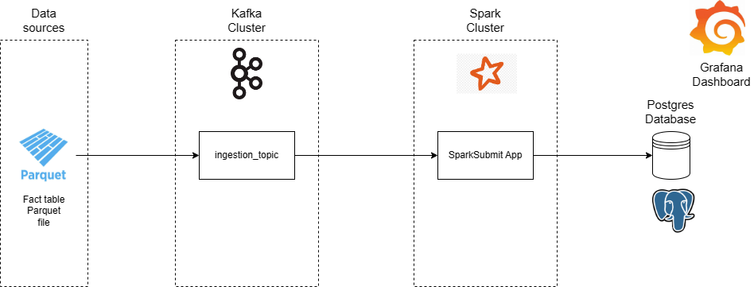
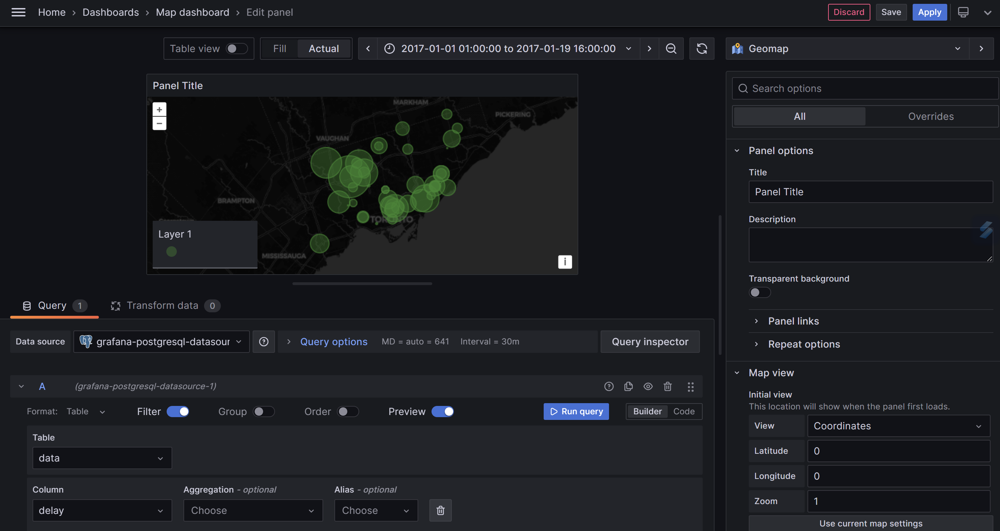

# Project Meteorif: Streaming
## Table of Contents
- [Project Meteorif: Streaming](#project-meteorif-streaming)
  - [Table of Contents](#table-of-contents)
- [Introduction](#introduction)
- [Architecture](#architecture)
- [How to run](#how-to-run)
- [Contact](#contact)
- [Acknowledgements](#acknowledgements)

# Introduction
This project is part of the Meteorif project. It is a streaming application that ingests Fact table data. The data is then sent to a Kafka topic and consumed by a Spark Streaming application. 
The data is then processed, sent to a [PostgreSQL](https://www.postgresql.org/) database and visualized in a [Grafana](https://grafana.com/) dashboard. 
Please make sure that you read the [Batch processing README](https://github.com/5IF-Data-Engineering/deng-project/tree/main#project-meteorif) 

# Architecture


First, we have a Parquet file that contains the Fact table data. This file is read by a [Spark](https://spark.apache.org/) application. The data is then sent to a [Kafka](https://kafka.apache.org/) topic by a Kafka Producer.
Then, the data is consumed by a Spark Streaming application. The data is then processed and sent to a [PostgreSQL](https://www.postgresql.org/) database. Finally, the data is visualized in a [Grafana](https://grafana.com/) dashboard.

# How to run
First, you need the Parquet file that contains Fact table data and put it in the `producer_data/data` folder. (See [Contact](#contact))

Then, you need to run the following commands:
```bash
docker-compose up -d
```
This will start the [Kafka](https://kafka.apache.org/), [Grafana](https://grafana.com/) and [PostgreSQL](https://www.postgresql.org/) containers.

Then, you need to create the `ingestion_data` topic:
```bash
docker exec -it kafka kafka-topics --bootstrap-server localhost:9092 --create --topic ingestion_data --partitions 1 --replication-factor 1 --if-not-exists
```

Then, you need to run the following commands:
```bash
python3 producer_data/producer_data.py
```
This will send the data to the `ingestion_data` topic.

Create the `streaming` database in [PostgreSQL](https://www.postgresql.org/):
```bash
docker exec -it postgres psql -U postgres -c "CREATE DATABASE streaming;"
```

Then, you launch the Spark Streaming application:
- Go inside the [Spark](https://spark.apache.org/) container:
```bash
docker exec -it spark-master sh
```

- Then, launch the Spark Streaming application:
```bash
./bin/spark-submit --master local[*] --driver-class-path ./jars/postgresql-42.2.23.jar --jars ./jars/postgresql-42.2.23.jar --name data-streaming --packages org.apache.spark:spark-sql-kafka-0-10_2.12:3.1.2 ./app/data_streaming.py
```
- Finally, exit the container:
```bash
exit
```

Finally, you can visualize the data in the [Grafana](https://grafana.com/) dashboard on `localhost:3000` with the following credentials:
- Username: `admin`
- Password: `admin`



If you want to make sure that the data is sent to the `ingestion_data` topic, you can run the following command:
```bash
docker exec -it kafka kafka-console-consumer --bootstrap-server localhost:9092 --topic ingestion_weather_data --from-beginning
```

# Contact
- [Minh NGO](mailto:ngoc-minh.ngo@insa-lyon.fr)

# Acknowledgements
- [Kafka](https://kafka.apache.org/)
- [Spark](https://spark.apache.org/)
- [PostgreSQL](https://www.postgresql.org/)
- [Grafana](https://grafana.com/)
- [Docker](https://www.docker.com/)
- [Docker Compose](https://docs.docker.com/compose/)